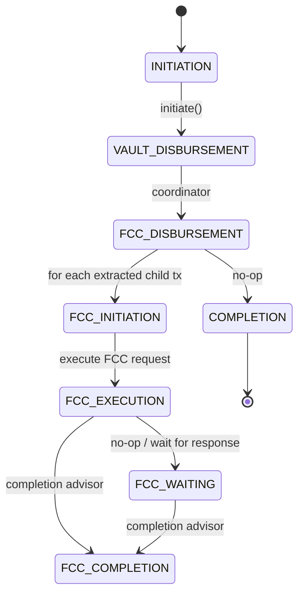

```mermaid
stateDiagram-v2
    [*] --> INITIATION

    INITIATION --> VAULT_DISBURSEMENT: initiate()
    VAULT_DISBURSEMENT --> FCC_DISBURSEMENT: coordinator

    FCC_DISBURSEMENT --> FCC_INITIATION: for each extracted child tx
    FCC_INITIATION --> FCC_EXECUTION: execute FCC request

    FCC_EXECUTION --> FCC_WAITING: no-op / wait for response
    FCC_EXECUTION --> FCC_COMPLETION: completion advisor
    FCC_WAITING --> FCC_COMPLETION: completion advisor

    FCC_DISBURSEMENT --> COMPLETION: no-op
    COMPLETION --> [*]
```