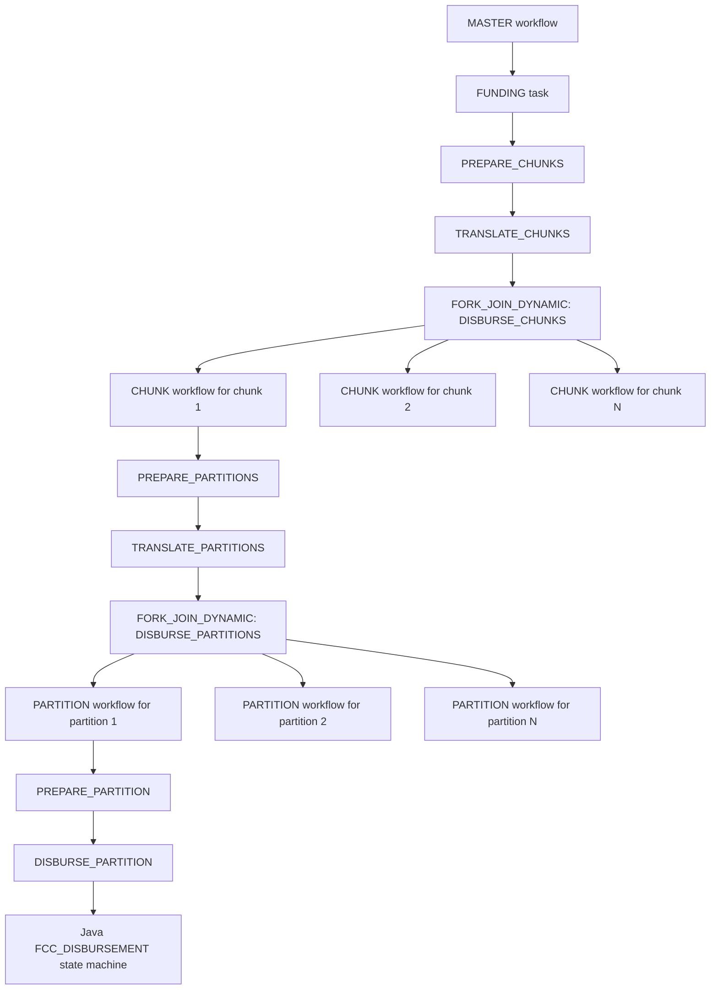

```mermaid
flowchart TD
  A["MASTER workflow"] --> B["FUNDING task"]
  B --> C["PREPARE_CHUNKS"]
  C --> D["TRANSLATE_CHUNKS"]
  D --> E["FORK_JOIN_DYNAMIC: DISBURSE_CHUNKS"]

  E --> F1["CHUNK workflow for chunk 1"]
  E --> F2["CHUNK workflow for chunk 2"]
  E --> F3["CHUNK workflow for chunk N"]

  F1 --> G["PREPARE_PARTITIONS"]
  G --> H["TRANSLATE_PARTITIONS"]
  H --> I["FORK_JOIN_DYNAMIC: DISBURSE_PARTITIONS"]

  I --> J1["PARTITION workflow for partition 1"]
  I --> J2["PARTITION workflow for partition 2"]
  I --> J3["PARTITION workflow for partition N"]

  J1 --> K["PREPARE_PARTITION"]
  K --> L["DISBURSE_PARTITION"]
  L --> M["Java FCC_DISBURSEMENT state machine"]
```