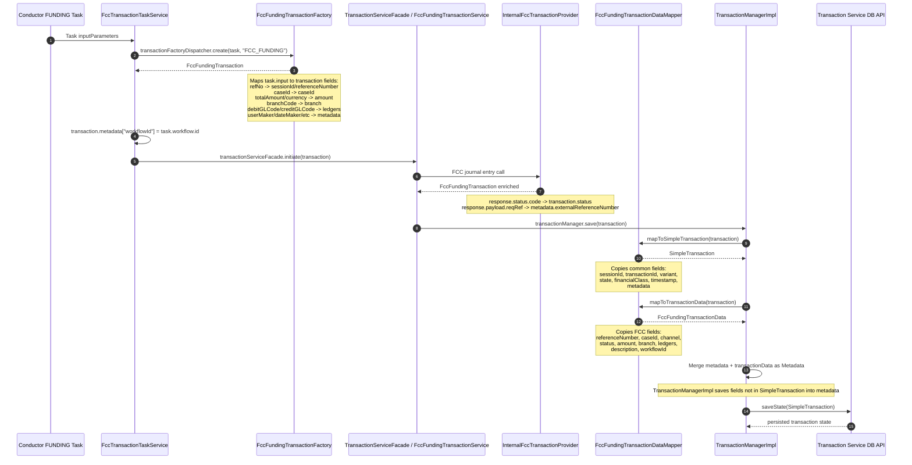

```mermaid
sequenceDiagram
    autonumber

    participant Conductor as Conductor FUNDING Task
    participant Worker as FccTransactionTaskService
    participant Factory as FccFundingTransactionFactory
    participant Service as TransactionServiceFacade / FccFundingTransactionService
    participant Provider as InternalFccTransactionProvider
    participant Mapper as FccFundingTransactionDataMapper
    participant TM as TransactionManagerImpl
    participant TxAPI as Transaction Service DB API

    Conductor->>Worker: Task inputParameters
    Worker->>Factory: transactionFactoryDispatcher.create(task, "FCC_FUNDING")

    Factory-->>Worker: FccFundingTransaction
    Note over Factory: Maps task.input to transaction fields:<br/>refNo -> sessionId/referenceNumber<br/>caseId -> caseId<br/>totalAmount/currency -> amount<br/>branchCode -> branch<br/>debitGLCode/creditGLCode -> ledgers<br/>userMaker/dateMaker/etc -> metadata

    Worker->>Worker: transaction.metadata["workflowId"] = task.workflow.id

    Worker->>Service: transactionServiceFacade.initiate(transaction)
    Service->>Provider: FCC journal entry call

    Provider-->>Service: FccFundingTransaction enriched
    Note over Provider: response.status.code -> transaction.status<br/>response.payload.reqRef -> metadata.externalReferenceNumber

    Service->>TM: transactionManager.save(transaction)

    TM->>Mapper: mapToSimpleTransaction(transaction)
    Mapper-->>TM: SimpleTransaction
    Note over Mapper: Copies common fields:<br/>sessionId, transactionId, variant,<br/>state, financialClass, timestamp,<br/>metadata

    TM->>Mapper: mapToTransactionData(transaction)
    Mapper-->>TM: FccFundingTransactionData
    Note over Mapper: Copies FCC fields:<br/>referenceNumber, caseId, channel,<br/>status, amount, branch, ledgers,<br/>description, workflowId

    TM->>TM: Merge metadata + transactionData as Metadata
    Note over TM: TransactionManagerImpl saves fields not in SimpleTransaction into metadata

    TM->>TxAPI: saveState(SimpleTransaction)
    TxAPI-->>TM: persisted transaction state
```