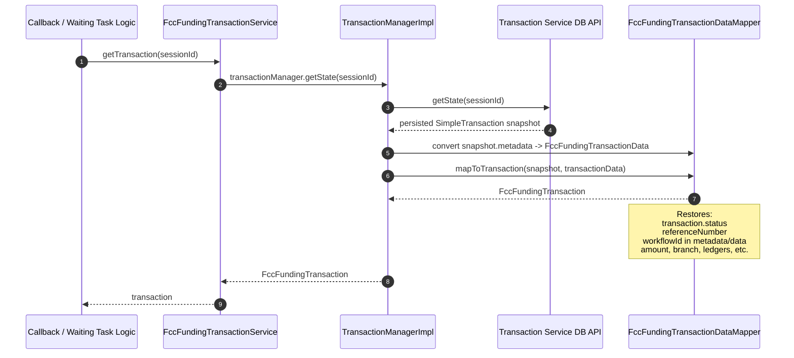

```mermaid
sequenceDiagram
    autonumber

    participant Caller as Callback / Waiting Task Logic
    participant Service as FccFundingTransactionService
    participant TM as TransactionManagerImpl
    participant TxAPI as Transaction Service DB API
    participant Mapper as FccFundingTransactionDataMapper

    Caller->>Service: getTransaction(sessionId)
    Service->>TM: transactionManager.getState(sessionId)
    TM->>TxAPI: getState(sessionId)
    TxAPI-->>TM: persisted SimpleTransaction snapshot

    TM->>Mapper: convert snapshot.metadata -> FccFundingTransactionData
    TM->>Mapper: mapToTransaction(snapshot, transactionData)

    Mapper-->>TM: FccFundingTransaction
    Note over Mapper: Restores:<br/>transaction.status<br/>referenceNumber<br/>workflowId in metadata/data<br/>amount, branch, ledgers, etc.

    TM-->>Service: FccFundingTransaction
    Service-->>Caller: transaction
```