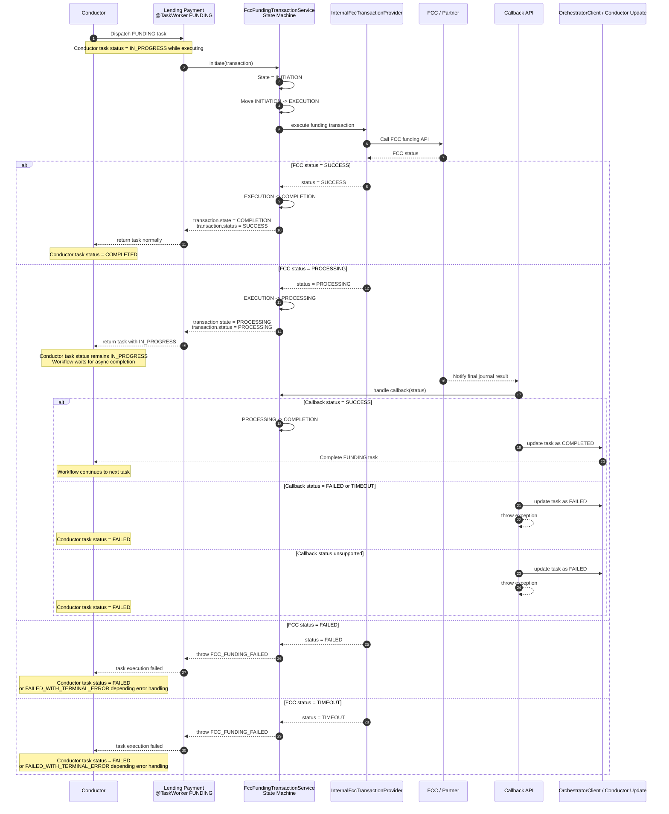

```mermaid
sequenceDiagram
    autonumber

    participant Conductor
    participant Worker as Lending Payment<br/>@TaskWorker FUNDING
    participant SM as FccFundingTransactionService<br/>State Machine
    participant Provider as InternalFccTransactionProvider
    participant FCC as FCC / Partner
    participant Callback as Callback API
    participant Orchestrator as OrchestratorClient / Conductor Update

    Conductor->>Worker: Dispatch FUNDING task
    Note over Conductor,Worker: Conductor task status = IN_PROGRESS while executing

    Worker->>SM: initiate(transaction)
    SM->>SM: State = INITIATION

    SM->>SM: Move INITIATION -> EXECUTION
    SM->>Provider: execute funding transaction
    Provider->>FCC: Call FCC funding API
    FCC-->>Provider: FCC status

    alt FCC status = SUCCESS
        Provider-->>SM: status = SUCCESS
        SM->>SM: EXECUTION -> COMPLETION
        SM-->>Worker: transaction.state = COMPLETION<br/>transaction.status = SUCCESS
        Worker-->>Conductor: return task normally
        Note over Conductor: Conductor task status = COMPLETED

    else FCC status = PROCESSING
        Provider-->>SM: status = PROCESSING
        SM->>SM: EXECUTION -> PROCESSING
        SM-->>Worker: transaction.state = PROCESSING<br/>transaction.status = PROCESSING
        Worker-->>Conductor: return task with IN_PROGRESS
        Note over Conductor: Conductor task status remains IN_PROGRESS<br/>Workflow waits for async completion

        FCC-->>Callback: Notify final journal result
        Callback->>SM: handle callback(status)

        alt Callback status = SUCCESS
            SM->>SM: PROCESSING -> COMPLETION
            Callback->>Orchestrator: update task as COMPLETED
            Orchestrator-->>Conductor: Complete FUNDING task
            Note over Conductor: Workflow continues to next task

        else Callback status = FAILED or TIMEOUT
            Callback->>Orchestrator: update task as FAILED
            Callback-->>Callback: throw exception
            Note over Conductor: Conductor task status = FAILED

        else Callback status unsupported
            Callback->>Orchestrator: update task as FAILED
            Callback-->>Callback: throw exception
            Note over Conductor: Conductor task status = FAILED
        end

    else FCC status = FAILED
        Provider-->>SM: status = FAILED
        SM-->>Worker: throw FCC_FUNDING_FAILED
        Worker-->>Conductor: task execution failed
        Note over Conductor: Conductor task status = FAILED<br/>or FAILED_WITH_TERMINAL_ERROR depending error handling

    else FCC status = TIMEOUT
        Provider-->>SM: status = TIMEOUT
        SM-->>Worker: throw FCC_FUNDING_FAILED
        Worker-->>Conductor: task execution failed
        Note over Conductor: Conductor task status = FAILED<br/>or FAILED_WITH_TERMINAL_ERROR depending error handling
    end
```