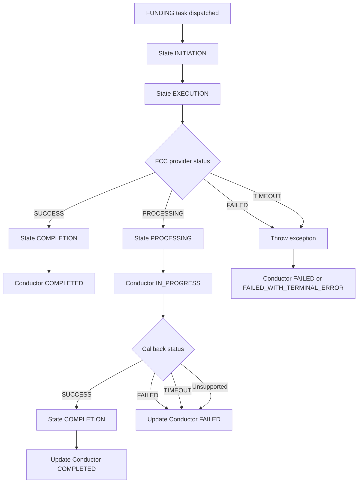

```mermaid
flowchart TD
    A[FUNDING task dispatched] --> B[State INITIATION]
    B --> C[State EXECUTION]
    C --> D{FCC provider status}

    D -->|SUCCESS| E[State COMPLETION]
    E --> F[Conductor COMPLETED]

    D -->|PROCESSING| G[State PROCESSING]
    G --> H[Conductor IN_PROGRESS]
    H --> I{Callback status}

    I -->|SUCCESS| J[State COMPLETION]
    J --> K[Update Conductor COMPLETED]

    I -->|FAILED| L[Update Conductor FAILED]
    I -->|TIMEOUT| L
    I -->|Unsupported| L

    D -->|FAILED| M[Throw exception]
    D -->|TIMEOUT| M
    M --> N[Conductor FAILED or FAILED_WITH_TERMINAL_ERROR]
```