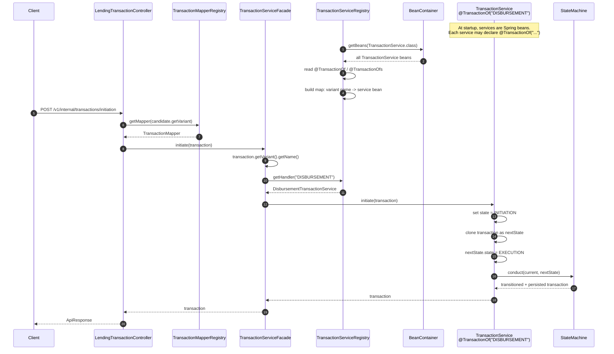

```mermaid
sequenceDiagram
    autonumber

    participant Client
    participant Controller as LendingTransactionController
    participant MapperRegistry as TransactionMapperRegistry
    participant Facade as TransactionServiceFacade
    participant ServiceRegistry as TransactionServiceRegistry
    participant BeanContainer
    participant Service as TransactionService<br/>@TransactionOf("DISBURSEMENT")
    participant StateMachine

    Note over Service: At startup, services are Spring beans.<br/>Each service may declare @TransactionOf("...")

    ServiceRegistry->>BeanContainer: getBeans(TransactionService.class)
    BeanContainer-->>ServiceRegistry: all TransactionService beans
    ServiceRegistry->>ServiceRegistry: read @TransactionOf / @TransactionOfs
    ServiceRegistry->>ServiceRegistry: build map: variant name -> service bean

    Client->>Controller: POST /v1/internal/transactions/initiation
    Controller->>MapperRegistry: getMapper(candidate.getVariant)
    MapperRegistry-->>Controller: TransactionMapper

    Controller->>Facade: initiate(transaction)
    Facade->>Facade: transaction.getVariant().getName()
    Facade->>ServiceRegistry: getHandler("DISBURSEMENT")
    ServiceRegistry-->>Facade: DisbursementTransactionService

    Facade->>Service: initiate(transaction)
    Service->>Service: set state = INITIATION
    Service->>Service: clone transaction as nextState
    Service->>Service: nextState.state = EXECUTION
    Service->>StateMachine: conduct(current, nextState)
    StateMachine-->>Service: transitioned + persisted transaction
    Service-->>Facade: transaction
    Facade-->>Controller: transaction
    Controller-->>Client: ApiResponse
```