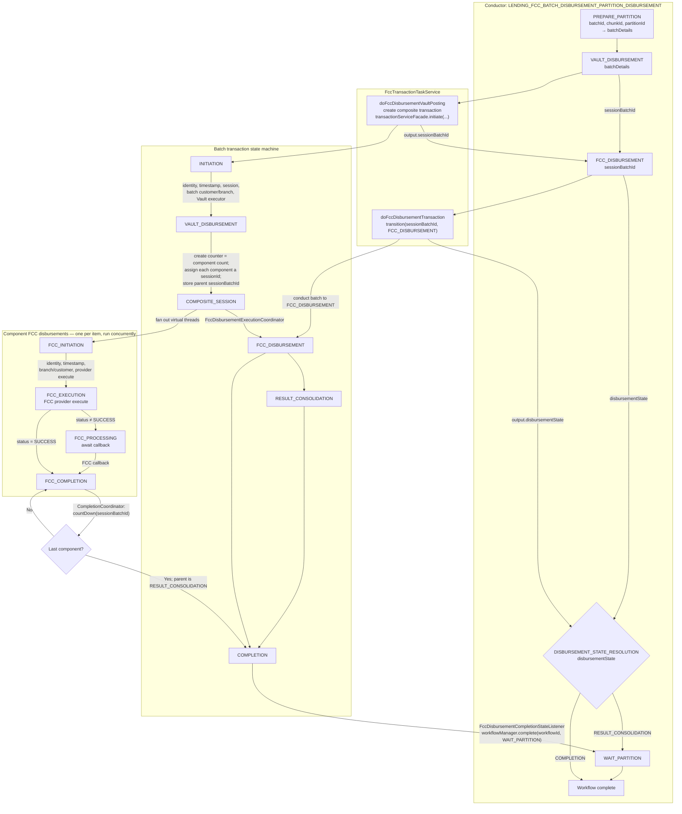

```mermaid
flowchart TB
  subgraph CW["Conductor: LENDING_FCC_BATCH_DISBURSEMENT_PARTITION_DISBURSEMENT"]
    A["PREPARE_PARTITION<br/>batchId, chunkId, partitionId<br/>→ batchDetails"]
    B["VAULT_DISBURSEMENT<br/>batchDetails"]
    C["FCC_DISBURSEMENT<br/>sessionBatchId"]
    D{"DISBURSEMENT_STATE_RESOLUTION<br/>disbursementState"}
    W["WAIT_PARTITION"]
    E["Workflow complete"]

    A --> B -->|"sessionBatchId"| C -->|"disbursementState"| D
    D -->|"RESULT_CONSOLIDATION"| W
    D -->|"COMPLETION"| E
  end

  subgraph TS["FccTransactionTaskService"]
    T1["doFccDisbursementVaultPosting<br/>create composite transaction<br/>transactionServiceFacade.initiate(...)"]
    T2["doFccDisbursementTransaction<br/>transition(sessionBatchId, FCC_DISBURSEMENT)"]
  end

  B --> T1
  T1 -->|"output.sessionBatchId"| C
  C --> T2
  T2 -->|"output.disbursementState"| D

  subgraph BATCH["Batch transaction state machine"]
    S0["INITIATION"]
    S1["VAULT_DISBURSEMENT"]
    S2["COMPOSITE_SESSION"]
    S3["FCC_DISBURSEMENT"]
    S4["RESULT_CONSOLIDATION"]
    S5["COMPLETION"]

    S0 -->|"identity, timestamp, session,<br/>batch customer/branch, Vault executor"| S1
    S1 -->|"create counter = component count;<br/>assign each component a sessionId;<br/>store parent sessionBatchId"| S2
    S2 -->|"FccDisbursementExecutionCoordinator"| S3
    S3 --> S4
    S3 --> S5
    S4 --> S5
  end

  T1 --> S0
  T2 -->|"conduct batch to FCC_DISBURSEMENT"| S3

  subgraph COMPONENTS["Component FCC disbursements — one per item, run concurrently"]
    P0["FCC_INITIATION"]
    P1["FCC_EXECUTION<br/>FCC provider execute"]
    P2["FCC_PROCESSING<br/>await callback"]
    P3["FCC_COMPLETION"]

    P0 -->|"identity, timestamp,<br/>branch/customer, provider execute"| P1
    P1 -->|"status ≠ SUCCESS"| P2
    P1 -->|"status = SUCCESS"| P3
    P2 -->|"FCC callback"| P3
  end

  S2 -->|"fan out virtual threads"| P0
  P3 -->|"CompletionCoordinator:<br/>countDown(sessionBatchId)"| Q{"Last component?"}
  Q -->|"No"| P3
  Q -->|"Yes; parent is RESULT_CONSOLIDATION"| S5
  S5 -->|"FccDisbursementCompletionStateListener<br/>workflowManager.complete(workflowId, WAIT_PARTITION)"| W
  W --> E
```