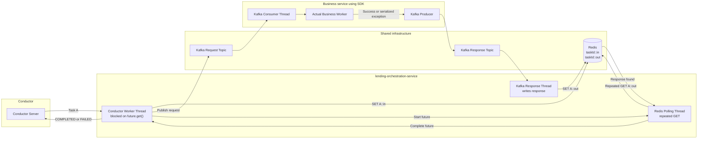

```mermaid
flowchart LR
    subgraph Conductor["Conductor"]
        CS["Conductor Server"]
    end

    subgraph Orchestrator["lending-orchestration-service"]
        CT["Conductor Worker Thread<br/>blocked on future.get()"]
        PE["Redis Polling Thread<br/>repeated GET"]
        RT["Kafka Response Thread<br/>writes response"]
    end

    subgraph Shared["Shared infrastructure"]
        KQ["Kafka Request Topic"]
        KS["Kafka Response Topic"]
        R[("Redis<br/>taskId::in<br/>taskId::out")]
    end

    subgraph Business["Business service using SDK"]
        BC["Kafka Consumer Thread"]
        BW["Actual Business Worker"]
        BP["Kafka Producer"]
    end

    CS -->|"Task A"| CT
    CT -->|"SET A::in"| R
    CT -->|"Publish request"| KQ
    CT -->|"Start future"| PE
    PE -->|"Repeated GET A::out"| R

    KQ --> BC
    BC --> BW
    BW -->|"Success or serialized exception"| BP
    BP --> KS

    KS --> RT
    RT -->|"SET A::out"| R
    R -->|"Response found"| PE
    PE -->|"Complete future"| CT
    CT -->|"COMPLETED or FAILED"| CS
```