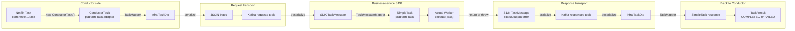

```mermaid
flowchart LR
    subgraph Conductor["Conductor side"]
        A["Netflix Task<br/>com.netflix...Task"]
        B["ConductorTask<br/>platform Task adapter"]
        C["infra TaskDto"]
    end

    subgraph RequestTransport["Request transport"]
        D["JSON bytes"]
        E["Kafka requests topic"]
    end

    subgraph SDK["Business-service SDK"]
        F["SDK TaskMessage"]
        G["SimpleTask<br/>platform Task"]
        H["Actual Worker<br/>execute(Task)"]
    end

    subgraph ResponseTransport["Response transport"]
        I["SDK TaskMessage<br/>status/output/error"]
        J["Kafka responses topic"]
        K["infra TaskDto"]
    end

    subgraph Result["Back to Conductor"]
        L["SimpleTask response"]
        M["TaskResult<br/>COMPLETED or FAILED"]
    end

    A -->|"new ConductorTask()"| B
    B -->|"TaskMapper"| C
    C -->|"serialize"| D
    D --> E
    E -->|"deserialize"| F
    F -->|"TaskMessageMapper"| G
    G --> H

    H -->|"return or throw"| I
    I -->|"serialize"| J
    J -->|"deserialize"| K
    K -->|"TaskMapper"| L
    L --> M
```